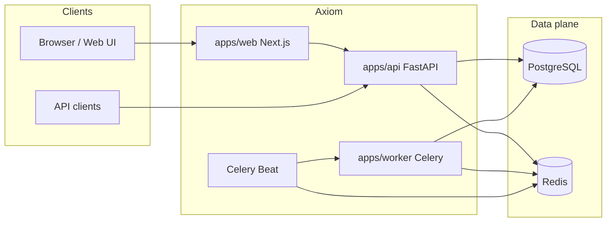

# Architecture

Axiom is a **monorepo** for compliant, rate-limited web scraping: a FastAPI service, Celery workers, a Next.js web app, shared Python libraries, and PostgreSQL plus Redis.

## System context

- **API** handles HTTP, authentication, orchestration, and optional **synchronous** extraction in-process.
- **Worker** runs **asynchronous** scrape tasks (`axiom.scrape`), persistence, and compliance checks before fetch.
- **Beat** triggers **`axiom.tick_schedules`** every minute to enqueue due **cron schedules** (see [deployment](./deployment.md)).
- **PostgreSQL** stores organizations, users, API keys, jobs, runs, extracted payloads, scrape audit events, and job schedules.
- **Redis** is the Celery broker and result backend, and backs **per-domain rate limiting** when compliance is enabled.

## Repository layout

| Path | Role |
| ---- | ---- |
| `apps/api` | FastAPI app, SQLAlchemy models, Alembic migrations |
| `apps/worker` | Celery application, tasks (`scrape`, `tick_schedules`, …) |
| `apps/web` | Next.js UI |
| `packages/compliance` | Shared compliance pipeline (lists, robots, rate limit, delay, audit helpers) |
| `packages/extractors` | HTML / Playwright extractors, `ExtractedDocument` model |
| `packages/exporters` | JSON, CSV, Markdown, HTML export from `ExtractedDocument` |
| `packages/testkit` | Optional shared pytest fixtures for the monorepo |
| `infra/` | Docker Compose for local full stack |

## Request flows

### Synchronous scrape (`POST /scrape`, `async=false`)

1. Authenticated request includes URL and engine (`html_requests` or `playwright`).
2. **Compliance** runs in the API process (`run_compliance_before_fetch`) unless disabled.
3. Extractor runs in a thread pool; result is an `ExtractedDocument` JSON payload (200).

### Asynchronous scrape (`POST /scrape`, `async=true`, default)

1. Compliance runs; then the API enqueues **`axiom.scrape`** on Celery and returns **202** with a Celery `task_id`.
2. The worker executes the same compliance gate (with `preverified` when the API already passed it), fetches/renders, and persists run/output as implemented in the task.

### Job queue (`POST /jobs`)

1. Compliance runs **before** creating the `Job` / `Run` rows.
2. A Celery task is sent with job/run IDs and optional **`max_retries_override`** for the scrape task.
3. Clients poll **`GET /jobs/{id}`**, runs, and optional **`GET /jobs/{id}/logs`** for audit rows.

### Cron schedules

1. **`POST /schedules`** stores a cron expression, payload, and metadata in **`job_schedules`**.
2. **Celery Beat** invokes **`axiom.tick_schedules`** periodically; the task claims due rows, runs compliance for the scheduled URL, creates a **Job** linked to **`schedule_id`**, and dispatches **`axiom.scrape`**.

## Shared libraries

- **`axiom_compliance`** is imported by both API and worker so policy (robots, lists, rate limits, delays) stays **one definition**.
- **`axiom_extractors`** normalizes pages into **`ExtractedDocument`**; **`axiom_exporters`** turns that into downloadable files for **`/exports`**.

## Observability and audit

- Structured **compliance audit** logging (`log_scrape_audit`) runs through the pipeline.
- The API can persist **scrape audit events** (and job-linked logs) for operator visibility; correlation IDs tie API and worker attempts together.

## Further reading

- [API specification](./api-spec.md) — routes and auth.
- [Compliance model](./compliance-model.md) — pipeline and configuration.
- [Deployment](./deployment.md) — processes, env, and Compose.
